# Standing Dead Tree Segmentation from Aerial Imagery

This repository presents a computer vision workflow for segmenting standing dead trees from aerial imagery. It compares classical machine-learning and deep-learning segmentation approaches on multispectral forest imagery and reports model performance using segmentation metrics, training logs, confusion matrices, and visual examples.

The project focuses on identifying small standing dead-tree regions in aerial scenes, where the foreground class is sparse and visually difficult to separate from surrounding vegetation.

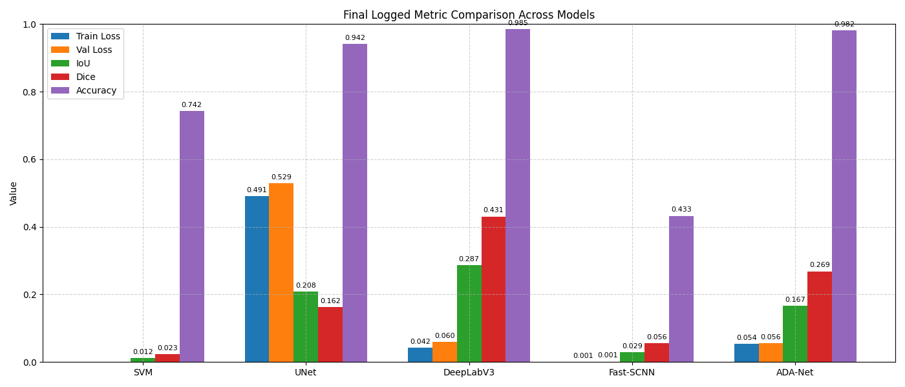

## Project Overview

Standing dead tree segmentation is a challenging remote-sensing task because the target regions are small, sparse, and often visually similar to healthy canopy or background vegetation.

This workflow compares several modelling approaches:

* **SVM Linear SVC**: a classical machine-learning baseline.
* **U-Net**: an encoder-decoder semantic segmentation model.
* **Fast-SCNN**: a lightweight segmentation network.
* **DeepLabV3**: an atrous-convolution-based segmentation model.
* **AdaNet-style model**: an attention-oriented neural segmentation variant included in the experiment runs.

The repository includes selected result visualisations, metric summaries, training logs, and reproducible split files. Raw image data, masks, model checkpoints, and large intermediate outputs are intentionally excluded.

## Key Features

* Multispectral aerial-image segmentation workflow.
* RGB and NRG/NIR-based input handling.
* Classical SVM baseline and deep segmentation models.
* Reproducible train/validation split files.
* Evaluation with IoU, Dice, accuracy, and confusion matrices.
* Training-curve comparisons across models.
* Selected qualitative examples and worst-case visualisations.
* Colab-first notebook workflow with lightweight repository outputs.

## Dataset

The raw dataset is not included in this repository.

This project uses the public Kaggle dataset associated with the ADA-Net paper:

**Aerial Imagery for Standing Dead Tree Segmentation**
Author: Mete Ahishali
Source: Kaggle
Associated paper: *ADA-Net: Attention-Guided Domain Adaptation Network with Contrastive Learning for Standing Dead Tree Segmentation Using Aerial Imagery*

Dataset page:

```text
https://www.kaggle.com/datasets/meteahishali/aerial-imagery-for-standing-dead-tree-segmentation
```

The expected local dataset structure is:

```text
data/
└── USA_segmentation/
    ├── RGB_images/
    ├── NRG_images/
    └── masks/
```

Each sample should have corresponding RGB, NRG, and mask files.

More detailed dataset setup notes are provided in:

```text
data/README.md
```

## Repository Structure

```text
standing-dead-tree-segmentation/
├── assets/
│   ├── comparison/
│   │   └── final_logged_metric_comparison_all_models.png
│   ├── confusion_matrices/
│   │   ├── adanet_confusion_matrix.png
│   │   ├── deeplabv3_confusion_matrix.png
│   │   ├── fastscnn_confusion_matrix.png
│   │   ├── svm_linear_svc_confusion_matrix.png
│   │   └── unet_confusion_matrix.png
│   ├── examples/
│   │   ├── adanet_worst_example.png
│   │   ├── deeplabv3_worst_example.png
│   │   ├── fastscnn_worst_example.png
│   │   ├── svm_linear_svc_visualization_example.png
│   │   ├── svm_linear_svc_worst_example.png
│   │   └── unet_worst_example.png
│   └── training_curves/
│       ├── accuracy_comparison_across_models.png
│       ├── dice_comparison_across_models.png
│       ├── iou_comparison_across_models.png
│       ├── train_loss_comparison_across_models.png
│       └── val_loss_comparison_across_models.png
├── data/
│   └── README.md
├── results/
│   ├── metrics/
│   │   ├── eval_results_adanet.csv
│   │   ├── eval_results_deeplabv3.csv
│   │   ├── eval_results_fastscnn.csv
│   │   └── eval_results_unet.csv
│   └── training_logs/
│       ├── training_log_adanet.csv
│       ├── training_log_deeplabv3.csv
│       ├── training_log_fastscnn.csv
│       ├── training_log_svm.csv
│       └── training_log_unet.csv
├── splits/
│   ├── train.csv
│   ├── train.txt
│   ├── val.csv
│   └── val.txt
├── .gitignore
├── README.md
├── Standing_Dead_Tree_Segmentation_from_Aerial_Imagery.ipynb
└── requirements.txt
```

## Methods

### SVM Linear SVC Baseline

The SVM baseline provides a classical machine-learning comparison point. It uses hand-crafted pixel-level features derived from the available image channels and trains a linear classifier to distinguish dead-tree pixels from background pixels.

This baseline is useful for understanding how far a simple model can go before using neural segmentation architectures.

### U-Net

U-Net is used as a compact encoder-decoder segmentation model. Its skip connections help preserve spatial detail between the encoder and decoder, which is important for small-object segmentation.

### Fast-SCNN

Fast-SCNN is included as a lightweight semantic segmentation model. It provides a comparison point for speed-oriented segmentation architectures.

### DeepLabV3

DeepLabV3 uses atrous convolution to capture broader context while maintaining spatial resolution. This is useful for dense prediction tasks where both local texture and wider scene context matter.

### AdaNet-style Model

The AdaNet-style model is included as an additional neural segmentation approach for comparison with the other deep-learning models.

## Evaluation Metrics

The workflow evaluates segmentation performance using standard pixel-level metrics.

| Metric    | Meaning                                                  |
| --------- | -------------------------------------------------------- |
| Accuracy  | Overall proportion of correctly classified pixels        |
| Dice      | Overlap-focused segmentation score                       |
| IoU       | Intersection-over-union between predicted and true masks |
| Precision | Fraction of predicted foreground pixels that are correct |
| Recall    | Fraction of true foreground pixels detected by the model |

Because standing dead tree pixels are sparse, overlap-focused metrics such as Dice and IoU are especially important for model comparison.

## Results

### Overall Model Comparison

The combined comparison figure summarises logged performance metrics across the evaluated models.


Detailed metric files are stored under:

```text
results/metrics/
```

## Training Curves

Training-curve summaries are included for model comparison.

### Accuracy Comparison

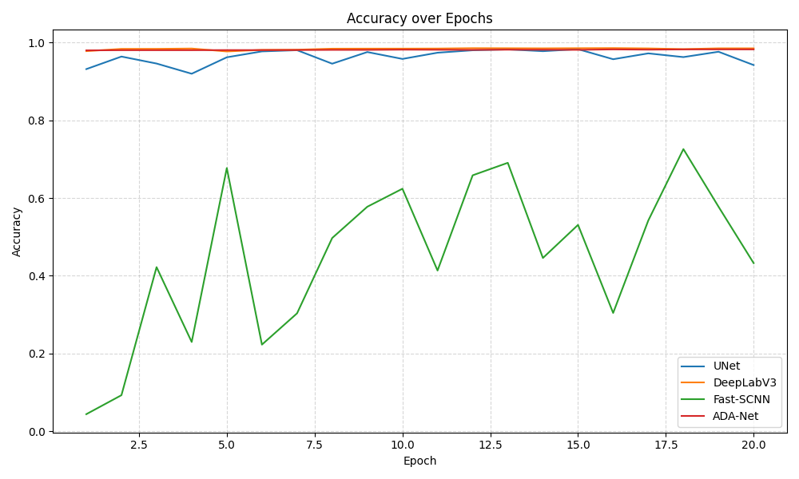

### Dice Comparison

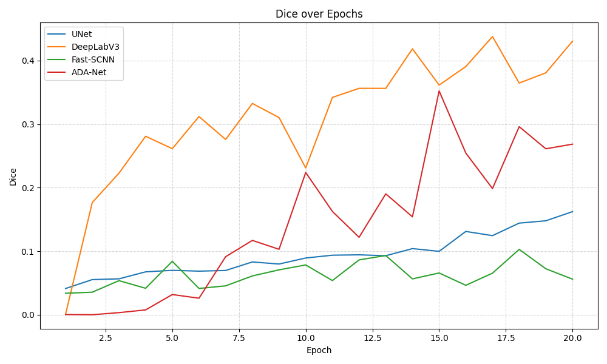

### IoU Comparison

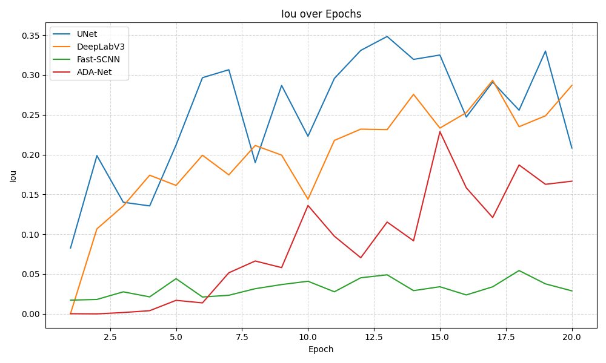

### Training Loss Comparison

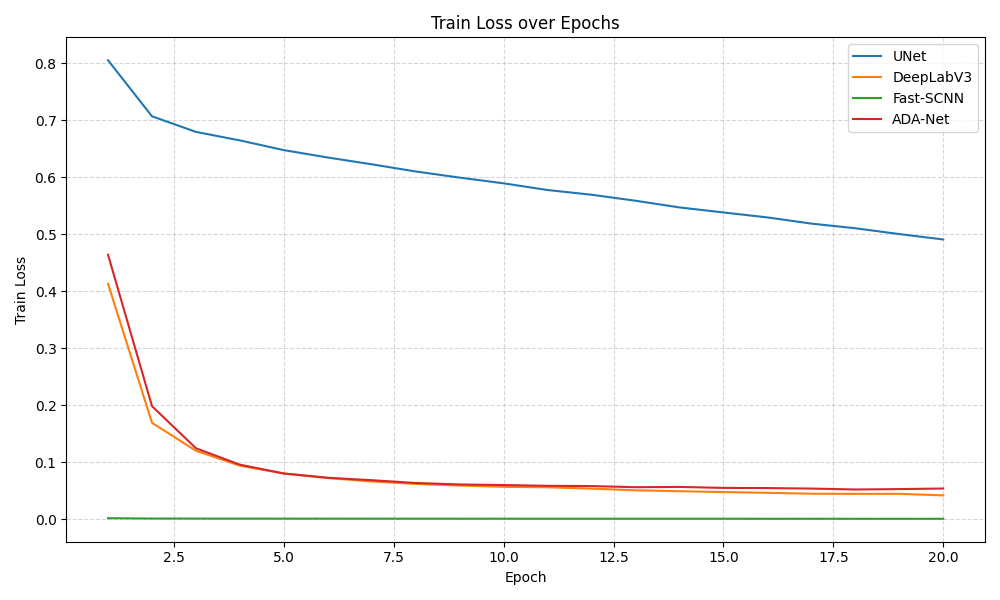

### Validation Loss Comparison

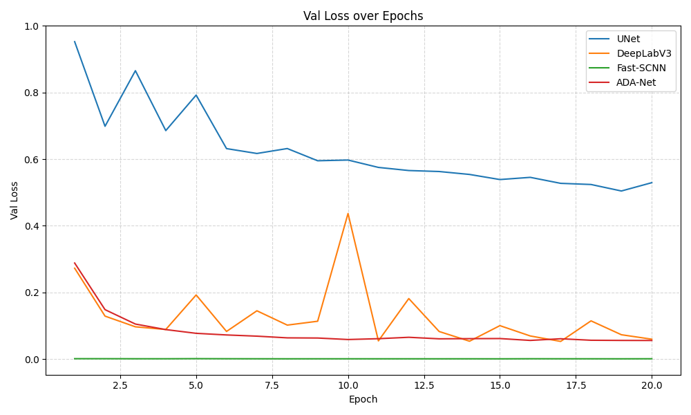

## Confusion Matrices

Confusion matrices are included for each evaluated model.

| Model              | Confusion Matrix                                                |
| ------------------ | --------------------------------------------------------------- |
| SVM Linear SVC     | `assets/confusion_matrices/svm_linear_svc_confusion_matrix.png` |
| U-Net              | `assets/confusion_matrices/unet_confusion_matrix.png`           |
| Fast-SCNN          | `assets/confusion_matrices/fastscnn_confusion_matrix.png`       |
| DeepLabV3          | `assets/confusion_matrices/deeplabv3_confusion_matrix.png`      |
| AdaNet-style model | `assets/confusion_matrices/adanet_confusion_matrix.png`         |

### U-Net Confusion Matrix

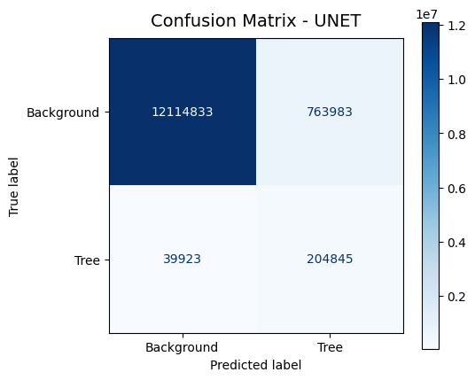

### DeepLabV3 Confusion Matrix

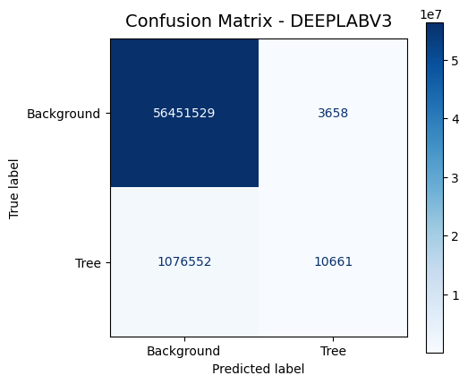

### Fast-SCNN Confusion Matrix

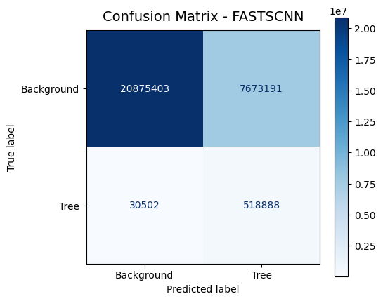

### SVM Linear SVC Confusion Matrix

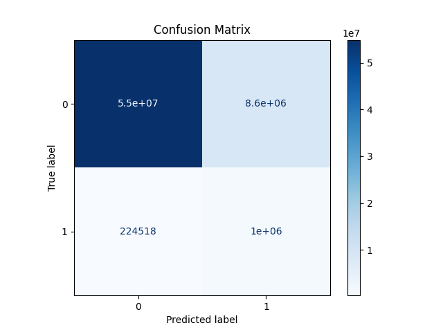

### AdaNet-style Confusion Matrix

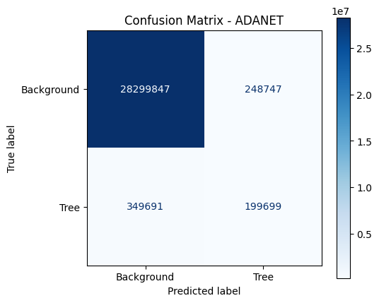

## Example Visualisations

Selected qualitative outputs are included under:

```text
assets/examples/
```

These files are derived visualisations for model inspection. They are not intended to redistribute the raw dataset.

### SVM Linear SVC Example

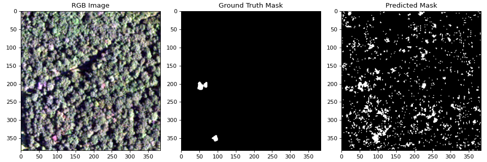

### Worst-case Examples

| Model              | Example File                                       |
| ------------------ | -------------------------------------------------- |
| SVM Linear SVC     | `assets/examples/svm_linear_svc_worst_example.png` |
| U-Net              | `assets/examples/unet_worst_example.png`           |
| Fast-SCNN          | `assets/examples/fastscnn_worst_example.png`       |
| DeepLabV3          | `assets/examples/deeplabv3_worst_example.png`      |
| AdaNet-style model | `assets/examples/adanet_worst_example.png`         |

## Included Outputs

The repository includes lightweight outputs for inspection and reproducibility.

### Assets

| Folder                       | Description                                                 |
| ---------------------------- | ----------------------------------------------------------- |
| `assets/comparison/`         | Final model comparison visualisation                        |
| `assets/confusion_matrices/` | Confusion matrices for evaluated models                     |
| `assets/examples/`           | Selected qualitative examples and worst-case visualisations |
| `assets/training_curves/`    | Training, validation, and metric comparison plots           |

### Results

| Folder                   | Description                 |
| ------------------------ | --------------------------- |
| `results/metrics/`       | Evaluation metric CSV files |
| `results/training_logs/` | Training-log CSV files      |

### Splits

| File               | Description                   |
| ------------------ | ----------------------------- |
| `splits/train.csv` | Reproducible training split   |
| `splits/train.txt` | Training split file list      |
| `splits/val.csv`   | Reproducible validation split |
| `splits/val.txt`   | Validation split file list    |

The split files are lightweight metadata files. They do not contain the raw images or segmentation masks.

## Files Not Included

The following files and folders are intentionally excluded from this repository:

```text
archive.zip
*.zip
USA_segmentation/
data/USA_segmentation/
dataset/
datasets/
raw/
combined_inputs/
*.npy
*.npz
checkpoints/
models/
weights/
*.pt
*.pth
*.pkl
*.ckpt
outputs/
predictions/
full_prediction_masks/
```

Raw images, raw masks, trained model checkpoints, intermediate arrays, full prediction masks, large local outputs, and dataset archives are not redistributed.

## Setup

Install dependencies with:

```bash
pip install -r requirements.txt
```

Main dependencies:

```text
numpy
pandas
matplotlib
opencv-python
scikit-learn
torch
torchvision
Pillow
tqdm
ipython
jupyter
```

## How to Run

This project was developed as a notebook workflow.

Open:

```text
Standing_Dead_Tree_Segmentation_from_Aerial_Imagery.ipynb
```

Then run the notebook cells after preparing the dataset locally.

### 1. Download the Dataset

Download the dataset from Kaggle:

```text
https://www.kaggle.com/datasets/meteahishali/aerial-imagery-for-standing-dead-tree-segmentation
```

### 2. Extract the Dataset

Arrange the extracted files as:

```text
data/
└── USA_segmentation/
    ├── RGB_images/
    ├── NRG_images/
    └── masks/
```

### 3. Install Dependencies

```bash
pip install -r requirements.txt
```

### 4. Run the Notebook

Run the notebook from top to bottom.

The notebook will load the dataset, prepare inputs, train or evaluate segmentation models, generate metric summaries, and save selected visualisations.

## Colab and Local Execution Notes

The notebook is Colab-first. If running locally, update any fixed Google Drive or Colab paths so that they point to the cloned repository directory.

A local-friendly setup pattern is:

```python
from pathlib import Path

PROJECT_ROOT = Path.cwd().resolve()
```

This allows local paths such as `data/`, `splits/`, `results/`, and `assets/` to resolve relative to the repository root.

## Reproducibility Notes

The repository includes split files under `splits/` so that the same train/validation partition can be reused.

A full rerun requires the raw dataset to be downloaded from Kaggle and placed in the expected local structure.

Results may vary depending on random seeds, hardware, package versions, image preprocessing choices, and model-training settings.

## Limitations

* The repository does not include raw images or masks.
* The repository does not include trained model checkpoints.
* The project uses selected derived visualisations rather than full prediction-mask exports.
* The foreground class is sparse, so high pixel accuracy alone can be misleading.
* Model performance may vary depending on preprocessing, input channels, training duration, and split configuration.
* The notebook is Colab-first and may require path updates before local execution.

## Future Work

Possible extensions include:

* adding a held-out test split.
* training with additional augmentation strategies.
* evaluating class-imbalance-aware losses.
* adding model checkpoint loading for reproducible inference.
* comparing additional segmentation architectures.
* exporting a lightweight inference script.
* adding local path configuration for direct command-line execution.

## References

* Mete Ahishali. *Aerial Imagery for Dead Tree Segmentation*. Kaggle.
  `https://www.kaggle.com/datasets/meteahishali/aerial-imagery-for-standing-dead-tree-segmentation`

* Mete Ahishali, Anis Ur Rahman, Einari Heinaro, and Samuli Junttila. *ADA-Net: Attention-Guided Domain Adaptation Network with Contrastive Learning for Standing Dead Tree Segmentation Using Aerial Imagery*. arXiv:2504.04271, 2025.

## License and Reuse

No open-source license is currently granted for this repository. The notebook, generated reports, visualisations, split files, and documentation are provided for reference only unless otherwise stated.

The underlying dataset is provided by its original author through Kaggle. Users should follow the dataset provider's access terms and citation requirements.

Raw images, masks, trained model files, full prediction outputs, and dataset archives are not redistributed in this repository.
