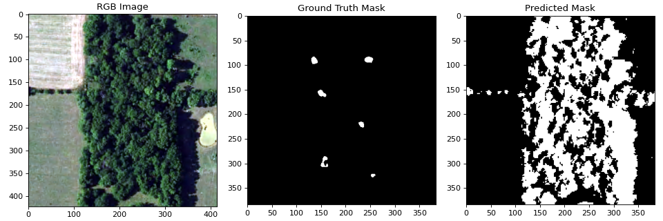
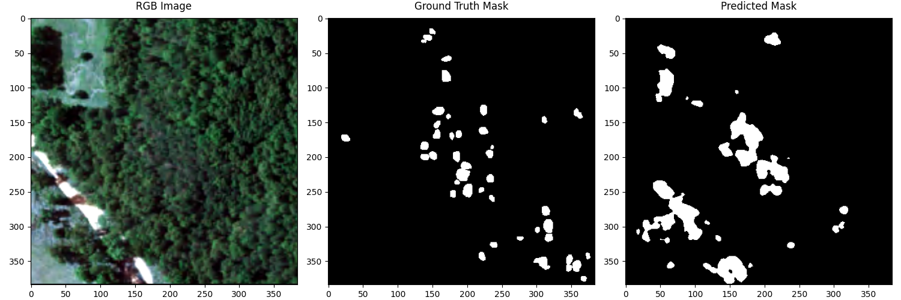
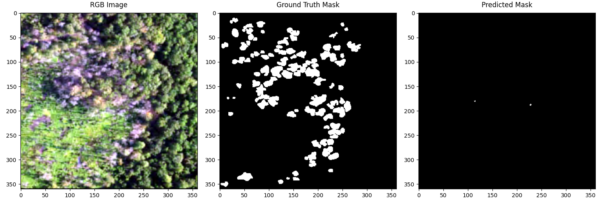
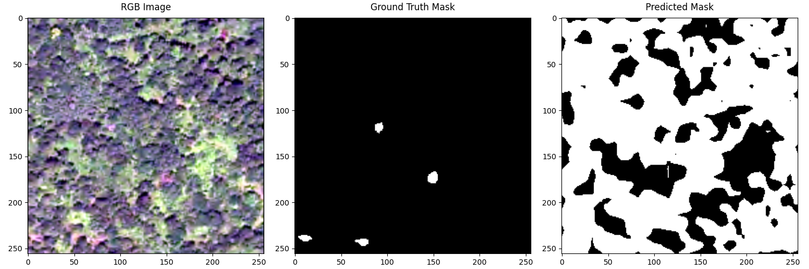
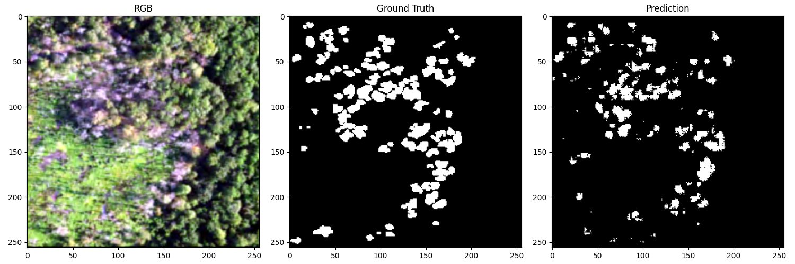

# Standing Dead Tree Segmentation from Aerial Imagery

This project explores semantic segmentation methods for detecting standing dead trees in aerial forest imagery. It compares a classical machine learning baseline with several deep learning models using RGB and near-infrared image information.

The project focuses on reproducible experimentation, model comparison, and visual analysis for remote sensing-based forest health monitoring.

## Project Overview

Standing dead trees are important indicators of forest condition and can contribute to ecological risks such as wildfire spread. Aerial and multispectral imagery provide a scalable way to monitor forest areas without requiring manual field inspection at every location.

This project compares several segmentation approaches:

* Linear SVM baseline with pixel-level RGB and near-infrared features
* UNet segmentation model
* DeepLabV3-based segmentation model
* Fast-SCNN-style lightweight segmentation model
* ADA-Net-inspired lightweight segmentation model

The models are evaluated using common segmentation metrics, including Dice score, IoU, accuracy, precision, and recall.

## Repository Structure

```text
.
├── Standing_Dead_Tree_Segmentation_from_Aerial_Imagery.ipynb
├── README.md
├── requirements.txt
├── .gitignore
├── data/
│   └── README.md
├── splits/
│   ├── train.csv
│   ├── train.txt
│   ├── val.csv
│   └── val.txt
├── results/
│   ├── metrics/
│   │   ├── eval_results_adanet.csv
│   │   ├── eval_results_deeplabv3.csv
│   │   ├── eval_results_fastscnn.csv
│   │   └── eval_results_unet.csv
│   └── training_logs/
│       ├── training_log_adanet.csv
│       ├── training_log_deeplabv3.csv
│       ├── training_log_fastscnn.csv
│       ├── training_log_unet.csv
│       └── training_log_svm.csv
└── assets/
    ├── comparison/
    │   └── final_logged_metric_comparison_all_models.png
    ├── training_curves/
    │   ├── accuracy_comparison_across_models.png
    │   ├── dice_comparison_across_models.png
    │   ├── iou_comparison_across_models.png
    │   ├── train_loss_comparison_across_models.png
    │   └── val_loss_comparison_across_models.png
    ├── confusion_matrices/
    │   ├── adanet_confusion_matrix.png
    │   ├── deeplabv3_confusion_matrix.png
    │   ├── fastscnn_confusion_matrix.png
    │   └── unet_confusion_matrix.png
    └── examples/
        ├── adanet_worst_example.png
        ├── deeplabv3_worst_example.png
        ├── fastscnn_worst_example.png
        ├── svm_linear_svc_visualization_example.png
        ├── svm_linear_svc_worst_example.png
        └── unet_worst_example.png
```

## Dataset

The raw dataset is not included in this repository.

This project uses the public Kaggle dataset associated with the ADA-Net paper:

**Aerial Imagery for Dead Tree Segmentation**
Author: Mete Ahishali
Source: Kaggle
Associated paper: *ADA-Net: Attention-Guided Domain Adaptation Network with Contrastive Learning for Standing Dead Tree Segmentation Using Aerial Imagery*

The dataset contains aerial forest imagery with RGB images, near-infrared false-colour imagery, and manually annotated segmentation masks. The original dataset should be downloaded directly from Kaggle rather than redistributed through this repository.

After downloading and extracting the dataset, arrange the local files as:

```text
data/
└── USA_segmentation/
    ├── RGB_images/
    ├── NRG_images/
    └── masks/
```

The raw image files, masks, archives, model checkpoints, and generated intermediate arrays are intentionally excluded from version control.

For more details about the expected local data layout, see `data/README.md`.

## Methods

### Linear SVM Baseline

The Linear SVM model is used as a classical machine learning baseline. It operates on pixel-level RGB and near-infrared features and provides a non-neural comparison point for the segmentation task.

### UNet

UNet is implemented as an encoder-decoder convolutional segmentation model with skip connections. It is used as a strong deep learning baseline for dense binary segmentation.

### DeepLabV3

DeepLabV3 is included as a semantic segmentation model with multi-scale contextual feature extraction. It provides a comparison against a deeper architecture commonly used for segmentation tasks.

### Fast-SCNN-style Model

A lightweight Fast-SCNN-style model is implemented to evaluate the trade-off between segmentation quality and computational efficiency.

### ADA-Net-inspired Model

The project also includes an ADA-Net-inspired lightweight model. This model is not a full reproduction of the original ADA-Net domain adaptation framework. Instead, it is included as an attention-inspired segmentation variant for comparison with the other implemented models.

The original ADA-Net paper is cited as related work because it introduced an attention-guided domain adaptation framework for standing dead tree segmentation using aerial imagery.

## Results

The experiment outputs are summarised through selected visualisations and CSV logs. Full generated outputs, model checkpoints, intermediate arrays, raw images, and prediction masks are not included in the repository.

### Overall Model Comparison


The comparison chart summarises the main evaluation metrics across the implemented models. It provides a compact overview of the trade-offs between accuracy, Dice score, IoU, precision, and recall.

## Training Curves

### Accuracy Comparison


### Dice Score Comparison


### IoU Comparison


### Training Loss Comparison


### Validation Loss Comparison


## Qualitative Examples

The following examples show representative prediction behaviour and failure cases. They are included to support visual inspection beyond aggregate metric values.

### Linear SVM Example


### Worst-case Examples

| Model            | Example                                                                 |
| ---------------- | ----------------------------------------------------------------------- |
| Linear SVM       |   |
| UNet             |            |
| DeepLabV3        |  |
| Fast-SCNN-style  |   |
| ADA-Net-inspired |       |

## Confusion Matrices

The following confusion matrices provide a pixel-level view of model behaviour, including true background pixels, predicted background pixels, true tree pixels, and predicted tree pixels.

### UNet


### DeepLabV3


### Fast-SCNN-style Model


### ADA-Net-inspired Model


## Reproducibility

The repository includes fixed train and validation split files under `splits/` so that experiments can be repeated using the same data partition.

The CSV files under `results/` store evaluation summaries and training histories for the compared models.

This repository is organised as a Colab-first workflow. The notebook can be run in a Colab-style environment after the dataset is placed in the expected directory structure.

For local execution, some path definitions may need to be adjusted because the original workflow was developed around a Colab-style workspace.

## Installation

Install the required Python packages with:

```bash
pip install -r requirements.txt
```

Main dependencies include:

* NumPy
* pandas
* Matplotlib
* OpenCV
* scikit-learn
* PyTorch
* torchvision
* Pillow
* tqdm
* Jupyter

## How to Run

### Colab-first workflow

1. Download the dataset from Kaggle.
2. Upload or mount the dataset in the expected directory structure.
3. Install dependencies using `requirements.txt`.
4. Open the notebook:

```text
Standing_Dead_Tree_Segmentation_from_Aerial_Imagery.ipynb
```

5. Run the notebook sections in order.

The notebook covers environment setup, data preparation, model training, evaluation, and result visualisation.

### Local execution

The notebook can also be adapted for local execution. To run it locally:

1. Clone this repository.
2. Install the required dependencies.
3. Download the dataset from the original Kaggle source.
4. Place the dataset under the expected `data/USA_segmentation/` structure.
5. Adjust any Colab-specific path definitions if needed.
6. Run the notebook in Jupyter.

```bash
jupyter notebook Standing_Dead_Tree_Segmentation_from_Aerial_Imagery.ipynb
```

## Notes

Large generated files are intentionally excluded from this repository, including:

* Raw dataset files
* Dataset archives
* Model checkpoints
* Intermediate `.npy` arrays
* Full prediction masks
* Local experiment workspaces
* Private documents or non-public source materials

This keeps the repository focused on source code, reproducibility files, selected results, and documentation.

## Limitations

* The notebook is currently organised around a Colab-first workflow.
* Local execution may require path adjustments.
* Raw data and trained model checkpoints are not included.
* The included visualisations and CSV files summarise selected experiment outputs rather than all generated intermediate files.
* The ADA-Net-inspired model is a lightweight segmentation variant, not a full reproduction of the original ADA-Net domain adaptation framework.

## References

* Mete Ahishali, Anis Ur Rahman, Einari Heinaro, and Samuli Junttila, *ADA-Net: Attention-Guided Domain Adaptation Network with Contrastive Learning for Standing Dead Tree Segmentation Using Aerial Imagery*, arXiv:2504.04271, 2025.
* Mete Ahishali, *Aerial Imagery for Dead Tree Segmentation*, Kaggle, 2025.
* Olaf Ronneberger, Philipp Fischer, and Thomas Brox, *U-Net: Convolutional Networks for Biomedical Image Segmentation*, 2015.
* Liang-Chieh Chen, Yukun Zhu, George Papandreou, Florian Schroff, and Hartwig Adam, *Encoder-Decoder with Atrous Separable Convolution for Semantic Image Segmentation*, 2018.
* Rudra P. K. Poudel, Stephan Liwicki, and Roberto Cipolla, *Fast-SCNN: Fast Semantic Segmentation Network*, 2019.
* scikit-learn documentation, LinearSVC.
* PyTorch documentation, torchvision segmentation models.

## License

No open-source license is provided for this repository. The code and documentation are shared for reference only. Dataset and third-party materials remain subject to their original licenses and terms of use.
